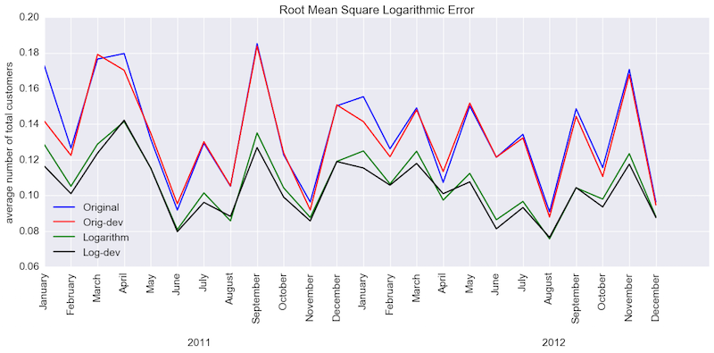
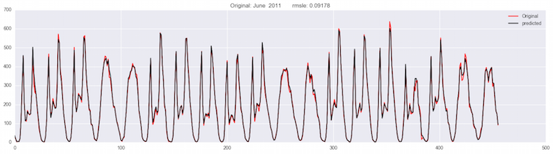
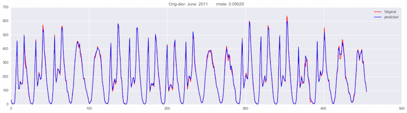
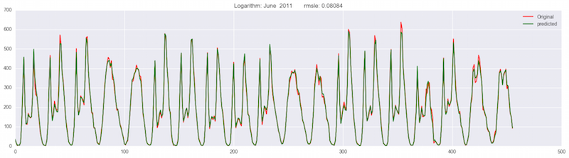
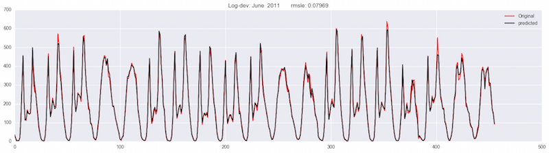

# Kaggle-Bike-Sharing
[Kaggle's Bike Sharing problem](https://www.kaggle.com/c/bike-sharing-demand). I explopre the data, preprocess, visualize, analyze and an try different linear and nonlinear regression models and compare their performance on the data set. Each section is treated in a separate ipython notebook for ease of review. In summary, random forest gave the best values for Root Mean Squared Logarithmic Error (RMSLE), and the best model fitting results are for fitting on the deviations from the average logarithmic values (see 
[10 - Kaggle - bike share system - Random Forest - comparing results](https://github.com/AmirNi2016/Kaggle-Bike-Sharing/blob/master/10%20-%20Kaggle%20-%20bike%20share%20system%20-%20Random%20Forest%20-%20comparing%20results.ipynb) for the details):

Examples of random forest fitting based on different methods of engineering the target values (red lines are the actual data):

### [01 - Kaggle - bike share system -  Problem formulation](https://github.com/AmirNi2016/Kaggle-Bike-Sharing/blob/master/01%20-%20Kaggle%20-%20bike%20share%20system%20-%20problem%20formulation.ipynb)
Description of the problem, the data set (features, targets) and discussion of the evaluation metric.

### [02 - Kaggle - bike share system - Data preprocessing](https://github.com/AmirNi2016/Kaggle-Bike-Sharing/blob/master/02%20-%20Kaggle%20-%20bike%20share%20system%20-%20data%20preprocessing.ipynb)
Preprocessing: using pandas' time series capabilities, we extract numerical values of date (year, month, day) and time (hour) from the `datetime` column. Also, we make one additional data set where the categorical data are represented by dummy matrices.

### [03 - Kaggle - bike share system - data visualization](https://github.com/AmirNi2016/Kaggle-Bike-Sharing/blob/master/03%20-%20Kaggle%20-%20bike%20share%20system%20-%20data%20visualization.ipynb)
Exporatory data analysis: we plot the average number of customers for different day time periods, weekdays and months over the two year time span. We use groupby and aggregate capabilities of the panadas to obtain the average number of customers for different scenarios (see **Tutorial - Multi Indexig and Groupby in Pandas.ipynb** for a tutorial on code details).
The plots show that the business had had growth from 2011 to 2012. Casual customers use the system more on weekends while registerd customers use the system more on workdays. The data shows a seasonality pattern. The maximum usage is between 10:00 am and 5:00 pm. 

### [04 - Kaggle - bike share system - Adding customer average to the features](https://github.com/AmirNi2016/Kaggle-Bike-Sharing/blob/master/04%20-%20Kaggle%20-%20bike%20share%20system%20-%20Adding%20customer%20average%20to%20the%20features.ipynb)
We would like to extract the maximum possible information from the data to train our model. Since Kaggle's bike sharing challenge is an intrapolation problem (except for December 2012 with is an extrapolation), it is reasonable hypothesis to assume that the unknown customer number during the last ten days of each month is close to the average of the known values for each weekday and time frame. So, in our first attempt, we add these average values as new columns of features. For this purpose we use pandas' groupby, aggregation, and multi-indexing capabilities. The new data frames are stored as new CSV files.

### [05 - Kaggle - bike share system - data analysis](https://github.com/AmirNi2016/Kaggle-Bike-Sharing/blob/master/05%20-%20Kaggle%20-%20bike%20share%20system%20-%20data%20analysis.ipynb)
After the aformentioned data preprocessing, manipulation and visualization, the next step is to analyze them further and investigate the correlations. We can then brainstorm on possible machine learning models to be used for this problem. The basic property to study is the correlation between the features and the possibility of [multicollinearity](https://en.wikipedia.org/wiki/Multicollinearity). Deviation of the customer number from its average values (the one we made in section 04) has almost no correlation with time and date features. The pairplot of each feature with each target (the deviation value) does not show linear relationships. Therefore, possibly, the linear regression may not be a good model. However, we examin it to test the hypothesis.  

### [06 - Kaggle - bike share system - Ordinary Linear Regression](https://github.com/AmirNi2016/Kaggle-Bike-Sharing/blob/master/06%20-%20Kaggle%20-%20bike%20share%20system%20-%20Ordinary%20Linear%20Regression.ipynb)
Here we train our first machine learning model. We employ ordinary regression model with mean squared error cost function. The predictions based on the deviation of customer number from the average give better RMSLE than predictions based on the customer number. Removing the collinear features leads to slight improvement, but nothing significant.

### [07 - Kaggle - bike share system - Random Forest](https://github.com/AmirNi2016/Kaggle-Bike-Sharing/blob/master/07%20-%20Kaggle%20-%20bike%20share%20system%20-%20Random%20Forest.ipynb)
As the first candidate for nonliner regression, we employ random forest regressor from scikit learn. The results are much better than the ordinary linear regression model. Contrary to linear regression, here rmsle of the original values behaves better than the deviation values.

